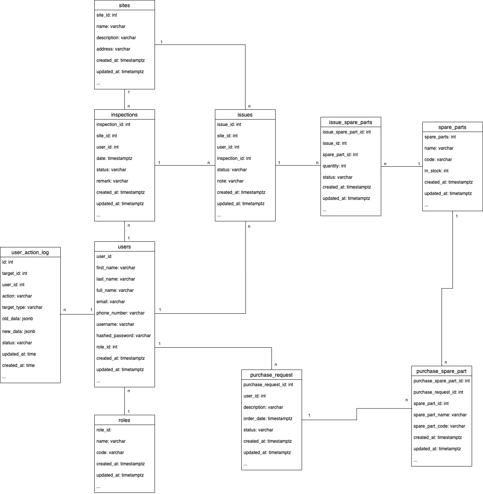

# Backend

Backend is a core backend for Usecase2B. Wrote by Go and deployed by [Dwarves Foundation](http://dwarves.foundation)

## Overview

- Language: Go
- Source control: [Github](https://github.com/nnhuyhoang/simple_rest_project/backend)

## System Architecture

Our system following clean architecture with some customizations


## Source Code Architecture

Below we describe the conventions or tools specific to golang project.

```tree
├── .gitignore
├── .env.sample
├── Makefile
├── k8s
├── Dockerfile
├── docker-compose.yaml
├── go.mod
├── go.sum
├── README.md
├── cmd
│   ├── server
│   │   └── main.go
├── migrations
│   ├── schema
│   └── seed
├── docs
├── pkg
│   ├── app
│   ├── config
│   └── errors
│   └── logger
│   └── mw
│   └── util
│   └── routes
│   └── handler
│   └── repo
│   └── model
```

A brief description of the layout:

- `.env.sample` environment variable samples.
- `k8s` k8s config.
- `Makefile` is used to build the project. **You need to tweak the variables based on your project**.
- `README.md` detailed description of the project.
- `cmd` contains main packages.
- `migrations` contains migrations sql files.
- `docs` contains swagger.
- `pkg` places most of project business logic and locate `api` package.
  - `app` contain application information (app version,...)
  - `config` load/read config module
  - `errors` defines error message
  - `logger` defines logger off application
  - `mv` defines middlewares (authentication, authorization)
  - `util` contains utils function which are used through server
  - `routes` contain routing definitions, it represent delivery layer in our system
  - `handler` represent usecase layer in our system where implement business logic
  - `repo` represent repository layer in our system which contains function used for communicate with database
  - `model` represent entity layer in our system which contain model definitions

### Run code

1. Init database - `make init`
2. Migrate database - `make migrate-up`
3. Run server - `make run`
4. Seed data for local - `make seed`

### Run test

To start testing process, please try the following cmd - `make test`

### Documetation

Documentation of backend

### System account

- Field Technician:

  - email: jon@gmail.com
  - password: password

- Field Technician Manager:
  - email: daenerys@gmail.com
  - password: password

### Database diagram



### State machine

`Manager dashboard site status`


### Flow

`Daily task for a Field Technicain`


`Variation of in_stock(inventory) in spare parts table`


`Create issue process`


`Create purchase request process`


### Swagger

- Swagger version: 2.0
- Swagger URL: [Swagger](http://develop-api.sp-digital.daf.ug/swagger/index.html)
